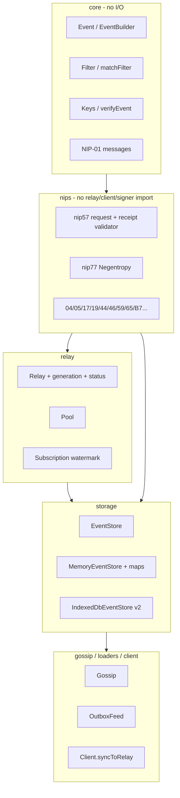
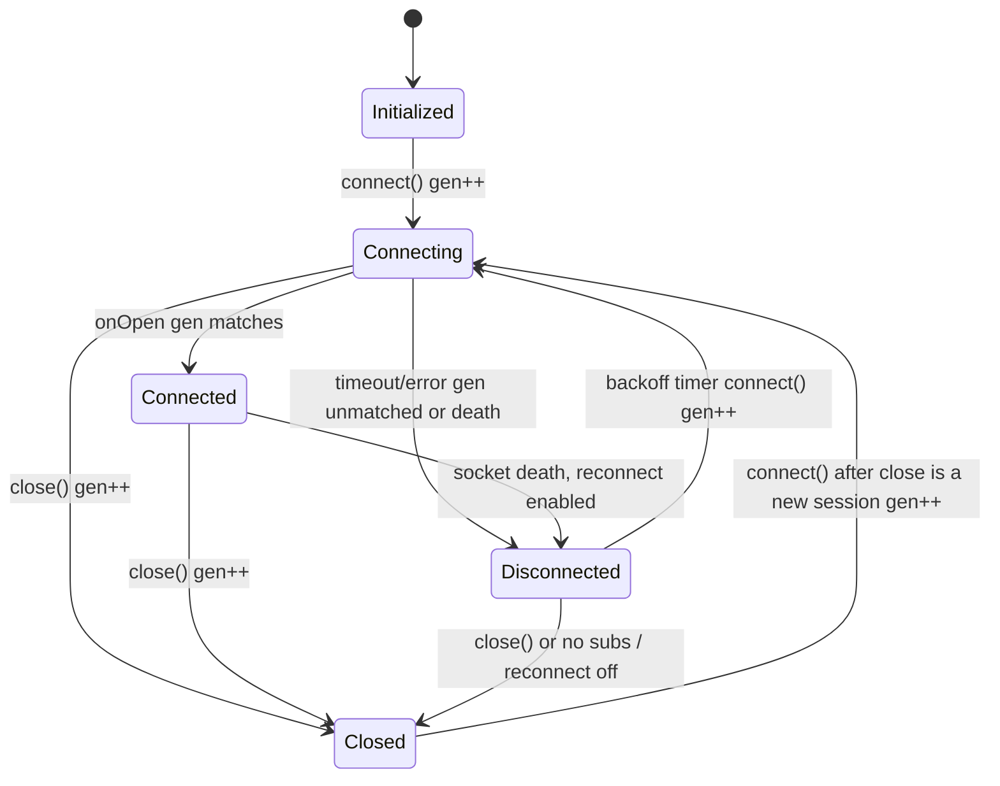
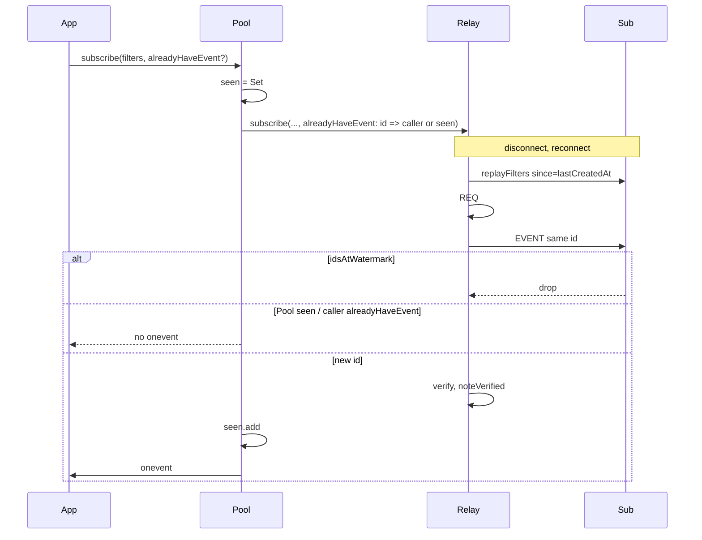
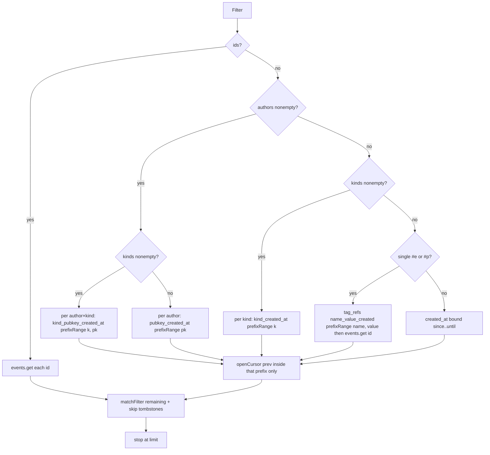

> **Stale for protocol-alignment claims.** Status: superseded for those claims by [`docs/protocol.md`](protocol.md) after the spec-alignment train (Kind shrink, NIP-46 NIP-05 login deletion, NIP-59 empty seals, NIP-10 extras, NIP-18/25 builders, NIP-57 remainder). Transport/storage items in this document (Relay generation, reconnect watermark, IDB v2, `negentropyItems`, OutboxFeed, NIP-50 docs) already shipped in earlier PRs (#22–#28) and must not be re-opened as if missing. NIP-57 is no longer “request only”.

# @qntx/nostr — Production-correct layered client SDK

| Field | Value |
| --- | --- |
| Title | Remaining work to make `@qntx/nostr` production-correct on implemented NIPs + transport/storage lifecycle |
| Author | TBD |
| Date | 2026-08-23 |
| Status | Draft |
| Package | `@qntx/nostr@0.0.0` (unpublished) |
| Target | Layered client SDK. Production-correct on the implemented surface. Not “all NIPs”. |

---

## Overview

`@qntx/nostr` is already a layered TypeScript Nostr SDK: one npm package with subpath exports, injected I/O, NIP modules that do not import relay/client/signer, and no runtime dependency on `3rdparty/nostr-tools`. Crypto, event verification, gift-wrap unwrap, AUTH retry, NIP-09 pubkey checks, NIP-44 32-byte keys, and pack `types` conditions are in place.

It is **not** yet enterprise-production-ready under the definition that binds this document. Three lifecycle defects remain: `Relay.close()` does not invalidate in-flight `#connecting`; reconnect replays filters verbatim; IndexedDB query and open are `getAll()` + JS `matchFilter` with in-memory tombstones. NIP-57 is request-only. Local NIP-77 sync materializes full events. Those gaps are the remaining work.

This design specifies generation-token connection control (`close()` owns `finish()`, not a raw reject), watermarked reconnect `since` (inclusive, plus same-second id dedup; AUTH retry REQs the same replay filters), IndexedDB v2 indexes + persisted tombstones with multi-store writes, then `EventStore.negentropyItems` once both backends can serve it without `getAll`, OutboxFeed resume `since` only when every author in a relay group has a bound, and a pure NIP-57 receipt validator (9735 + 9734 + bolt11 description hash) with no LNURL HTTP and no new lightning dependency.

### 中文摘要

当前库已经是分层的 TypeScript Nostr SDK：单包、子路径导出、I/O 注入、`nips` 不依赖 relay/client/signer、运行时不依赖 `nostr-tools`。加密、验签、gift-wrap 验签、AUTH 重试、NIP-09 公钥校验、NIP-44 32 字节密钥、打包 types 都已完成。按本文定义，它还不是企业级生产就绪：`Relay.close()` 不会作废进行中的 `#connecting`，且 connect 超时/abort 会误杀下一根 socket；重连原样重放 filter；IndexedDB 每次 `getAll()` + JS 过滤，删除墓碑只在内存。NIP-57 只有 zap request。NIP-77 同步会把全量事件读进内存。不追求实现全部 NIP，也不用 NIP 数量压 NDK。目标是：已实现 NIP 对齐现行 spec、传输无竞态、本地库在 10^4–10^5 事件下可查询并可做 NIP-77、测试覆盖协议与生命周期。计划按层合入 main：① Relay generation，`close()` 走 `finish()` 且超时只拆本轮 `ws`；② reconnect `since` 水位，AUTH 重试也用 `replayFilters()`；③ IndexedDB v2 索引与多 store 事务；④ 两边都实现 `negentropyItems` 后再改 `Client.syncToRelay`；⑤ OutboxFeed 仅在组内作者都有 bound 时带 `since`；⑥ NIP-57 收据校验（`bech32.decode(pr, false)`，不引入闪电库）；⑦ 文档化 NIP-50 `search`。Jumble 的双密钥 DM、ClientService 产品壳、NWC 不进本库。

---

## Background & Motivation

### Honest answers (required)

**1. Are there places that still need iteration?**

Yes. Confirmed against current code (not the stale `docs/protocol.md` audit):

| Gap | Evidence | Severity |
| --- | --- | --- |
| `Relay.close()` does not reject/clear in-flight `#connecting`; next `connect()` returns the stale promise | `src/relay/relay.ts` `connect()` L186–188 returns `#connecting` if set; `close()` L317–330 tears down the socket but never fails or clears `#connecting`; `finally` L287–289 only clears after the promise settles | High |
| `#resubscribeAll` replays `sub.filters` verbatim | `src/relay/relay.ts` L437–447; `Subscription.filters` is immutable original (`src/relay/subscription.ts` L41) | Medium (bandwidth + duplicate `onevent` unless caller supplies `alreadyHaveEvent`) |
| IndexedDB: `getAll()` + JS `matchFilter`; no secondary indexes; `#rebuildIndexes` on every `open()`; deletion tombstones only in memory | `src/storage/indexeddb.ts` `query` L186–207, `open` L78–85, `openDb` L244–256 version `1`, `#deletion` field L66 | High at 10^4–10^5 |
| `Client.syncToRelay` loads full events to build Negentropy storage | `src/client/client.ts` L760–761: `storage.query([filter])` then `storageFromEvents` | High at 10^5 |
| OutboxFeed `#bounds` is process-local | `src/loaders/outbox.ts` L87, L277–286 | Medium (reload loses resume `since`) |
| NIP-57 is zap request only | `src/nips/nip57.ts` L1–4, `makeZapRequest` only | Medium for any client that displays 9735 |
| `matchFilter` ignores `search` | `src/core/filter.ts` L16–47; `Filter.search` exists L12; no JSDoc | Low (document, do not fake FTS) |

**Verified already done — do not “fix”:**

- Unknown NIP-19 TLV ignored (`parseTLV` keeps extras; decode reads 0/1/2/3).
- EVENT verification exists (`Relay.#verify`, default `verifyEvent`).
- Pool does not drop relays on the reconnect path (`src/relay/pool.ts` L148–152, L175–179).
- NIP-59 unwrap verifies wrap and seal signatures (`src/nips/nip59.ts` L294–313).
- Pack exports have `types` conditions (`package.json` `exports`, `vite.config.ts` `customExports`).
- NIP-09 pubkey check and `a`-tag coordinates (`src/storage/deletion.ts` `planDeletion` L34–58). `docs/protocol.md` “stores apply e only; no pubkey check” is stale.
- Kind 14 reply `e` tags are unmarked (`src/nips/nip17.ts` L132–134). `docs/protocol.md` “include a reply marker” is stale.
- Gift-wrap verify, AUTH retry (`#authThenResubscribe` / `#authThenRepublish`), NIP-44 32-byte keys (`assert32` / `assertSecretKeyBytes`).

**2. Is the current version already an enterprise-production-ready complete Nostr TS library?**

No.

By the definition that binds this document, production-ready means: every *implemented* NIP matches `/Users/xu/Desktop/x/nips`; transport lifecycle is race-free; reconnect does not lose same-second events and does not unbounded-replay without id-dedup; local store serves query + NIP-77 without freezing the UI at 10^4–10^5 events; ESM + types on all subpaths + no runtime 3rdparty; tests cover protocol and lifecycle bugs; the library can replace nostr-tools + blossom-client-sdk + nostr-gadgets at jumble’s *library* layer.

Packaging, layering, crypto, and the implemented NIP *algorithms* are largely there. Transport close/connect, reconnect filter rewriting, and IndexedDB algorithmic complexity are not. NIP-57 receipts are not. That is the gap between “usable SDK” and “production-correct on the implemented surface”.

**3. Does it support all features and is it the most mature Nostr TS implementation beyond community versions?**

No, and that is not the goal.

- NIPs are not a checklist (`/Users/xu/Desktop/x/nips/README.md`). This library will not implement NIP-22/29/47/60/71/86/C7/etc. as a completeness sprint.
- NDK is a product kit: NWC, Cashu, NIP-22 comments, sessions, WoT packages, LNURL HTTP zaps. Feature count is not maturity on a shared surface.
- nostr-tools is the community baseline jumble actually imports. On the overlapping surface this library is already more spec-strict (NIP-77 4-element `NEG-OPEN` only, NIP-59 wrap verify, NIP-09 pubkey, typed errors, no `VerifiedEvent` brand) and architecturally cleaner (layers, injected I/O, no global pool). It is not more complete.
- nula is the Rust architectural reference (layers, storage trait, relay actor). This SDK already follows its layering (ADR-0001). It will not copy the 13-crate split, actor model, AdmitPolicy, or Monitor.

“Most mature beyond community” after this work means: on the implemented surface, more spec-correct and more typed than nostr-tools, with a race-free relay and an indexed local store. It does not mean “more NIPs than NDK”.

### Current state

Layers (from `docs/architecture.md` and `docs/adr/0001-layering.md`):

```
core → signer / nips → relay → storage / gossip / loaders → client
```

Implemented NIP modules (`src/nips/`): blossom, nip04, nip05, nip10, nip11, nip13, nip17, nip19, nip21, nip27, nip42, nip44, nip46, nip49, nip51, nip57 (request), nip59, nip65, nip77, nip96, nip98. Core NIP-01 kinds/filters/messages. `EventBuilder` covers NIP-18/25/70/09 tags. Storage applies NIP-09.

Jumble (`/Users/xu/Desktop/x/jumble`) still depends on `nostr-tools` and `blossom-client-sdk`. It does not depend on `nostr-gadgets`; it reimplements that layer in `client.service.ts` (~1700-line product shell), `SmartPool`, and `indexed-db.service.ts` (profiles, DMs, drafts — not a generic EventStore). The SDK must replace the *library* layer (events, filters, pool, signers, NIP crypto, blossom HTTP, loaders/gossip/outbox), not the product shell.

### Pain points that actually block the definition

1. Close during connect leaves a live `#connecting` Promise. A late `open` can mark the relay connected after `close()`, or the next `connect()` waits on a dead handshake.
2. Long-lived REQ after reconnect re-downloads the full filter. Without `alreadyHaveEvent`, `onevent` fires again. With `since: last+1`, NIP-01 inclusive `since` drops same-second events (`/Users/xu/Desktop/x/nips/01.md`: `since <= created_at <= until`).
3. `IndexedDbEventStore.query` and kind-5 `put` both `getAll()`. `#rebuildIndexes` scans every event on open. At 10^5 events this freezes a tab. Tombstones die with the JS heap; open recovers by scanning kind 5, which is the freeze.
4. `syncToRelay` cannot use an `(id, created_at)` projection because `EventStore` has no such method and IDB cannot serve it without indexes.

---

## Goals & Non-Goals

### Goals

- Race-free `Relay` connect/close/reconnect with a generation counter.
- Reconnect REQ uses `since = lastCreatedAt` (not `last+1`) plus same-second id dedup.
- IndexedDB schema v2: object-store indexes, persisted tombstones, cursor query, multi-store writes. One query path. Version bump allowed.
- `EventStore` then gains `negentropyItems` (and `count`) on **both** backends without `getAll`; only then `Client.syncToRelay` switches. No `query` fallback.
- OutboxFeed newest-bound derived from indexed `query({limit:1})`. Mixed relay groups do not clip unbound authors. No second storage API.
- NIP-57 Appendix F validator as a pure function of 9735 + embedded 9734 + bolt11. LNURL HTTP stays in the app.
- Document that `matchFilter` / local query ignore `search` (NIP-50 is relay-side).
- Tests for the lifecycle bugs and the IDB planner. Each PR green on `bun test tests` + `vp check`.
- Library layer sufficient to replace jumble’s nostr-tools + blossom-client-sdk + gadgets-equivalent (loaders/gossip/outbox/blossom).

### Non-goals

- Implement every NIP in `/Users/xu/Desktop/x/nips`.
- NWC (NIP-47), keyring, relay server.
- Split `Client` into 5 services / AdmitPolicy / Monitor; copy nula actor topology.
- Branded `PublicKey` types.
- Monorepo of 13 packages. One `@qntx/nostr` with subpaths.
- Jumble dual-key DM (kinds 10044/4454/4455) forked into NIP-17.
- Pull LNURL HTTP or WebLN into `nips`.
- Fake local full-text search for NIP-50.
- Compatibility shims for nostr-tools names (`kinds.ShortTextNote`, `BunkerSigner`, `generateSecretKey`, `VerifiedEvent`).
- Backward-compatible IDB dual query paths or generation-less close “for now”.
- Feature flags. Unpublished `0.0.0`; rollout = layered PRs on main.
- Metrics SDK. Existing Relay/Pool callbacks are enough.
- `docs/` published (gitignored, local-only). README stays the simplified user file.

---

## Key Decisions

1. **Generation counter is the connect/close control plane; `RelayStatus` is read-only observability.** nula’s `RelayStatus` enum (`Initialized → Connecting → Connected → Disconnected → Terminated`) is useful for callers. It does not fix the stale `#connecting` promise. A monotonic `#gen` captured by every connect-scoped closer does. `close()` and each new `connect()` bump `#gen`. `#connectFinish` **is** that attempt’s `finish()` (clears the attempt timer, identity-checks `#connecting`, then reject/resolve). Timeout, abort, `onError`, `onClose`, and `close()` all (1) no-op when captured `gen !== #gen`, (2) teardown **only the captured `ws`**, (3) never assign `#connecting = undefined` unless it is this promise. A late gen-1 timeout must not kill a gen-3 socket.
2. **Reconnect `since` is `lastCreatedAt`, never `last+1`.** NIP-01 `since` is inclusive. Same-second events would be lost. Dedup is `Subscription` watermark ids at that timestamp plus existing `alreadyHaveEvent` / Pool `seen`.
3. **Watermark updates only after successful verify.** Updating `lastCreatedAt` from unverified EVENT frames would let a forged future timestamp starve the subscription after reconnect.
4. **IndexedDB v2 stores plain `Event` objects** (`keyPath: "id"`). Secondary indexes on `kind` / `pubkey` / `created_at`. Tag (`e`/`p`) and replaceable address live in sibling stores, not wrapper rows. `get()` stays `Event | undefined`. No dual query path after upgrade.
5. **Tombstones persist in an object store.** In-memory `DeletionState` is a cache loaded from `tombstones`, not reconstructed by scanning all events on open.
6. **`EventStore` grows only methods that change complexity:** `negentropyItems(filter)` and `count(filters)`. No `checkId` (`get()` suffices). No outbox-bounds store API. **Do not switch `Client.syncToRelay` until IndexedDB v2 can serve `negentropyItems` without `getAll`.** Memory maps may land in the same PR as the trait; the trait PR implements both backends.
7. **OutboxFeed newest is derived from indexed `query` with `limit: 1`.** Oldest remains in-memory from observed events. No NIP-78 local record. **A relay-group REQ gets `since` only when every author/kind in that group has a bound after hydrate.** Mixed groups split filters (bounded vs unbounded) in the same REQ; they must not `min(newest)` across missing authors.
8. **NIP-57 receipts: pure validator, no HTTP, no new dependency, no throw.** `bech32.decode(pr, false)` (limit 90 is the `@scure/base` default and rejects every real invoice). Amount from HRP; skip 7-word timestamp; TLV types 1 (`p`) and 23 (`h`) only. Hash the **description tag string**, not `JSON.stringify(parsed)`. `validateZapReceipt` returns `{valid, reason}` on bad JSON / bad bech32. Caller passes `nostrPubkey` (and optional `lnurl`) from its own LNURL fetch.
9. **`matchFilter` does not implement `search`.** Relays receive `filter.search` on the wire unchanged. Local match ignores it. Documented on `Filter` and `matchFilter`.
10. **One package, layered PRs, no shims, no actor rewrite.** ADR-0001 stands. PR order is binding: gen → reconnect `since` → IDB v2 `query` → `negentropyItems` + `Client.syncToRelay` → OutboxFeed → NIP-57 → `search` JSDoc.

---

## Proposed Design

### Architecture (unchanged layering)



I/O remains structural injection: `verifyEvent`, `WebSocket`, `fetch`, `Nip46Transport`, `Nip59Crypto`. WASM verify stays injected.

---

### 1. Relay generation token and close/connect

#### Bug (current)

```186:189:src/relay/relay.ts
  async connect(opts?: { signal?: AbortSignal; timeoutMs?: number }): Promise<void> {
    if (this.#connected) return;
    if (this.#connecting) return this.#connecting;
```

```317:330:src/relay/relay.ts
  close(): void {
    this.#intentionalClose = true;
    this.#skipReconnect = true;
    this.#clearReconnectTimer();
    this.#stopPingLoop();
    this.#closeAllSubscriptions("relay closed");
    this.#rejectPublishes(new RelayClosedError("relay closed", this.url));
    this.#rejectCounts(new RelayClosedError("relay closed", this.url));
    this.#rejectNeg(new RelayClosedError("relay closed", this.url));
    this.#detachSocketHandlers();
    this.#teardownSocket();
    this.#connected = false;
    this.onclose?.();
  }
```

`close()` does not: bump a generation, settle `#connecting` via that attempt’s `finish()`, or prevent a late `onOpen` (L242–252) from setting `#connected = true` and calling `#resubscribeAll`. Worse, `connect()`’s timeout (L215–222) and abort (L224–230) call `this.#detachSocketHandlers()` and `this.#teardownSocket()` (the **current** socket, not the captured one) and `finish` assigns `this.#connecting = undefined` on error (L206) with no identity check. Sequence this PR must kill: `connect()` gen=1 → `close()` gen=2 → `connect()` gen=3 new `#ws` → gen-1 timeout fires → detaches gen-3 handlers and `this.#ws.close()`. nostr-tools `abstract-relay.ts` `close()` at least sets `connectionPromise = undefined` and detaches `onopen` before `ws.close()`. nula uses an actor so close cannot race a captured handler; we stay single-threaded-with-callbacks and need gen **plus** `finish()` ownership.

`RelayStatus` alone is insufficient: a status of `Terminated` does not stop an already-constructed `onOpen` or timeout from running.

#### State machine



`Closed` is not nula `Terminated`. Current API allows `close()` then `connect()` on the same instance (`connect()` already clears `#intentionalClose` at L190). Keep that. Generation makes the *previous* handshake inert.

#### Types and fields (`src/relay/relay.ts`)

```ts
export const RelayStatus = {
  Initialized: "initialized",
  Connecting: "connecting",
  Connected: "connected",
  Disconnected: "disconnected",
  Closed: "closed",
} as const;
export type RelayStatusName = (typeof RelayStatus)[keyof typeof RelayStatus];

// private
#gen = 0;
#status: RelayStatusName = RelayStatus.Initialized;
#connecting: Promise<void> | undefined;
/** This attempt’s `finish`. `close()` calls it; it is not raw `reject`. */
#connectFinish: ((err?: unknown) => void) | undefined;
#connectTimer: ReturnType<typeof setTimeout> | undefined;

get status(): RelayStatusName { return this.#status; }
get generation(): number { return this.#gen; } // useful in tests; keep public
```

Export `RelayStatus` from `src/relay/index.ts` and the root facade.

#### Transitions

Every connect attempt captures `const gen = ++this.#gen` and `const ws` created for **this** attempt. `#detachSocketHandlers()` / `#teardownSocket()` operate on instance fields (`#socketHandlers`, `#ws`) and must **not** be called from a stale timeout/abort. Stale closers teardown `ws` only.

**`finish` (owned by the attempt; stored as `#connectFinish`)**

```ts
const connecting = new Promise<void>((resolve, reject) => {
  let settled = false;
  const finish = (err?: unknown) => {
    if (settled) return;
    settled = true;
    clearTimeout(timer);
    if (this.#connectTimer === timer) this.#connectTimer = undefined;
    opts?.signal?.removeEventListener("abort", onAbort);
    if (this.#connectFinish === finish) this.#connectFinish = undefined;
    if (this.#connecting === connecting) this.#connecting = undefined;
    if (err) {
      reject(err instanceof Error ? err : new RelayConnectionError("connection failed", this.url));
    } else {
      resolve();
    }
  };
  this.#connectFinish = finish;
  // ...
});
this.#connecting = connecting;
await connecting;
// no `finally { this.#connecting = undefined }` — only finish() clears, and only this promise
```

Rules:

1. Never assign `#connecting = undefined` unless `this.#connecting === connecting`.
2. Never call instance `#teardownSocket()` / `#detachSocketHandlers()` from timeout or abort. Close/detach the captured `ws`. If `this.#ws === ws`, then `this.#ws = undefined` and clear `#socketHandlers` only when it still points at this attempt’s handlers.
3. Timeout, abort, `onOpen`, `onError`, `onClose`: if `gen !== this.#gen`, `ws.close()` on the **captured** socket only (if still connecting/open), then return. Do not `finish()`, do not call `#teardownSocket` / `#detachSocketHandlers`, do not assign `#connecting`.
4. `#connectTimer` is the attempt timeout. `close()` `clearTimeout`s it as well as `finish()`.

**`connect()`**

1. If `#connected` return.
2. If `#connecting` return that promise (coalesce the live attempt only).
3. `const gen = ++this.#gen`.
4. `#intentionalClose = false`; `#skipReconnect = false`; `#deathHandled = false`; `#clearReconnectTimer()`.
5. `#status = Connecting`.
6. Create the Promise; `#connectFinish = finish`; `#connecting = connecting`.
7. `const ws = new this.#WS(this.url)`; `this.#ws = ws`. Bind handlers that close over `gen` and `ws`.
8. `onOpen` (gen matches): `#connected = true`, `#status = Connected`, `#resubscribeAll()`, ping, `onreconnect` if this was a reconnect, `finish()`.
9. Timeout / abort / `onError` / `onClose` (gen matches): teardown **captured `ws`**, `finish(err)`, then `#handleSocketDeath` only if `gen === this.#gen`.

**`close()`**

1. `#gen += 1` (invalidates in-flight timeout, abort, and socket handlers).
2. `#status = Closed`.
3. `#intentionalClose = true`; `#skipReconnect = true`.
4. `#clearReconnectTimer()`; if `#connectTimer !== undefined` `clearTimeout` it and set undefined; `#stopPingLoop()`.
5. `#connectFinish?.(new RelayClosedError("relay closed", this.url))` — this **is** `finish()`, not raw `reject`. `finish()` identity-clears `#connecting`.
6. Close subs, reject publishes/counts/neg.
7. Detach **current** `#socketHandlers` and `#teardownSocket()` (the live socket only; gen already bumped).
8. `#connected = false`; `onclose`.

**`#handleSocketDeath`**

- If called from a closer whose captured `gen !== this.#gen`, return (close or a newer connect already owns the instance).
- Else existing `#deathHandled` logic. Reconnect path: `#status = Disconnected`. Terminal: `#status = Closed` if `#intentionalClose`, else `Disconnected` then `Closed` when giving up.

**`#scheduleReconnect`**

Unchanged backoff. Timer callback: if `#intentionalClose` or already `#connected`, return; then `connect()` (bumps gen). `close()` already `#clearReconnectTimer()`.

Do not use status as the reconnect predicate. Keep `#enableReconnect && !#intentionalClose && !#skipReconnect && #subs.size > 0`.

#### Pool

No API change. `ensureRelay` already keeps the map entry when `enableReconnect` is on (`pool.ts` L175–179). `relay.onclose` deletes the entry (`L149–152`) — user `close()` is terminal for that pool slot, which is correct.

#### Tests (`tests/relay.test.ts`)

- `close()` during in-flight `connect()` rejects with `RelayClosedError`; subsequent `connect()` is a new handshake (new socket); `#connecting` is not reused.
- Late `open` after `close()` does not set `connected` and does not send REQ.
- `close()` then `connect()` succeeds (new generation).
- **`close()` then `connect()` then the first attempt’s timeout must not kill the second socket** (second `connected` stays true; first timer must not detach gen-2 handlers). Force a long `connectTimeoutMs` on the first attempt, `close()`, `connect()` with a live mock that opens, then wait past the first timeout.
- Intentional close still does not schedule reconnect (existing test).

---

### 2. Reconnect `since` watermark

#### Spec constraint

NIP-01: if `since` is set, `created_at >= since`. Using `lastCreatedAt + 1` drops events that share the last timestamp.

#### Subscription (`src/relay/subscription.ts`)

Keep `readonly filters: Filter[]` as the original REQ. Add watermark state on the instance that survives reconnect (same object in `Relay.#subs`):

```ts
export class Subscription {
  readonly id: string;
  readonly filters: Filter[];
  readonly handlers: SubscriptionHandlers;
  eosed = false;
  closed = false;
  authRetried = false;

  /** Max verified created_at seen on this sub. */
  lastCreatedAt: number | undefined;
  /** Event ids with created_at === lastCreatedAt (verified). */
  readonly idsAtWatermark = new Set<string>();

  noteVerified(event: Event): void {
    if (this.lastCreatedAt === undefined || event.created_at > this.lastCreatedAt) {
      this.lastCreatedAt = event.created_at;
      this.idsAtWatermark.clear();
      this.idsAtWatermark.add(event.id);
      return;
    }
    if (event.created_at === this.lastCreatedAt) this.idsAtWatermark.add(event.id);
  }

  replayFilters(): Filter[] {
    const since = this.lastCreatedAt;
    if (since === undefined) return this.filters;
    return this.filters.map((f) => ({
      ...f,
      since: f.since === undefined ? since : Math.max(f.since, since),
    }));
  }
}
```

Do not store an unbounded all-ids set on `Subscription`. Long-lived firehoses would leak. Same-second set is small. Cross-second duplicates after reconnect are the caller’s `alreadyHaveEvent` / Pool `seen` (already unbounded per `Pool.subscribe` closure — existing, not new).

#### Relay EVENT path (`#onMessage` case `"EVENT"`)

Current (`relay.ts` L466–475):

```
receivedEvent?.(id)
if (alreadyHaveEvent?.(id)) return
if (!verify(event)) return
onevent?.(event)
```

New:

```
receivedEvent?.(id)
if (sub.idsAtWatermark.has(event.id)) return
if (sub.handlers.alreadyHaveEvent?.(event.id)) return  // still skip verify
if (!this.#verify(event)) return
sub.noteVerified(event)
sub.handlers.onevent?.(event)
```

`alreadyHaveEvent` remains “skip verify + onevent”. Do **not** `noteVerified` on that path (unverified `created_at` must not move the watermark). After a successful first delivery, watermark + Pool `seen` cover reconnect duplicates.

#### `#resubscribeAll`

```ts
#resubscribeAll(): void {
  for (const sub of this.#subs.values()) {
    if (sub.closed) continue;
    sub.eosed = false;
    sub.authRetried = false; // new socket may AUTH again
    try {
      this.#send(["REQ", sub.id, ...sub.replayFilters()]);
    } catch { /* not connected */ }
  }
}
```

Resetting `authRetried` is required: today it stays `true` across reconnect, so a post-reconnect `CLOSED auth-required:` drops the sub (`relay.ts` L496–501).

**`#authThenResubscribe` must REQ `sub.replayFilters()`, not `sub.filters`.** Today L832 is `this.#send(["REQ", sub.id, ...sub.filters])`. After reconnect the first REQ is watermarked; CLOSED `auth-required:` then AUTH then a second REQ of the **original** filters would undo the watermark on every AUTH-gated relay (the case that required the `authRetried` reset). When `lastCreatedAt` is unset, `replayFilters()` equals `sub.filters`.

```ts
this.#send(["REQ", sub.id, ...sub.replayFilters()]);
```

NIP-77 sessions are **not** in `#subs`; they live in `#neg` and are rejected on socket death (`#handleSocketDeath` → `#rejectNeg`). Do not reissue NEG-OPEN (same as nula `skip_reissue` in `nula-relay/src/inner/run.rs`). Caller retries `syncToRelay`.

Dummy ping REQs are not in `#subs`. Unchanged.

#### Who still dedupes



- `Relay.fetch` / `Pool.fetch` already dedupe in a local `Set` for the one-shot (`relay.ts` L641–664, `pool.ts` L299–328). They close after EOSE; reconnect is irrelevant.
- `Client.subscribe` with `gossip` has its own `seen` (`client.ts` L526).
- `Client.observe` → `storage.put` returns `"duplicate"` for known ids.

#### Tests (`tests/reconnect-nip04.test.ts` or `tests/reconnect.test.ts`)

- After reconnect, REQ filter has `since === last event.created_at` (not `+1`).
- Two events with the same `created_at` both arrive before drop; after reconnect both ids are watermarked; a third same-second new id is delivered.
- Event with `created_at === last` is not lost (proves not `last+1`).
- Forged EVENT (bad sig) with huge `created_at` does not move watermark.
- `alreadyHaveEvent: () => true` still skips verify (existing test in `tests/relay.test.ts`).
- After reconnect, `CLOSED auth-required:` triggers AUTH retry (`authRetried` reset). The **post-AUTH REQ must still carry inclusive `since`** (`replayFilters()`), not the raw original filters.

---

### 3. IndexedDB schema v2

Indexes and a correct `query()` land **before** `EventStore.negentropyItems` and before `Client.syncToRelay` switches off `query`. After this section, IDB `query({limit:1})` is a cursor, not `getAll`. The trait change is §4.

#### Current (v1)

- `factory.open(dbName, 1)` (`indexeddb.ts` L247).
- Store `events`, `keyPath: "id"`, value = plain `Event`.
- `query` / kind-5 `put` / `#rebuildIndexes` all `getAll()`.
- `#deletion` and `#replaceable` are JS heaps. Open rebuilds by scanning every event including applying kind 5 (`L92–118`).
- Helpers `idbPut` / `idbGet` / `idbDelete` each open `transaction(storeName: string)` — one store. That cannot keep sibling indexes consistent.

#### Target schema

Constant `IDB_VERSION = 2`. No dual query path. `onupgradeneeded` migrates v1 → v2 once.

| Store | keyPath | Value | Indexes |
| --- | --- | --- | --- |
| `events` | `id` | plain `Event` | `created_at` (`created_at`); `kind_created_at` (`[kind, created_at]`); `pubkey_created_at` (`[pubkey, created_at]`); `kind_pubkey_created_at` (`[kind, pubkey, created_at]`) |
| `tag_refs` | `key` (`${name}:${value}:${id}`) | `{ key, name, value, id, created_at }` | `name_value_created` (`[name, value, created_at]`) |
| `addresses` | `address` (`kind:pubkey:d`) | `{ address, id, created_at }` | — |
| `tombstones` | `key` | see below | — |

`tag_refs` only for `e` and `p` (notification / thread filters). Other `#x` filters fall through to candidate-set + `matchFilter`.

Tombstone rows:

```ts
type TombstoneRow =
  | { key: `id:${string}`; type: "id" }
  | { key: `pending:${string}`; type: "pending"; pubkey: string }
  | { key: `coord:${string}`; type: "coord"; until: number };
```

`DeletionState` remains the in-memory cache. `open()`: `idbGetAll(tombstones)` (small) → `absorb` into `#deletion`. Do **not** scan `events`.

Replaceable lookup: `addresses` store, not a rebuilt `Map` from `getAll()`. Keep `#replaceable` as a write-through cache filled on put/delete and on open via cursor of `addresses` (one row per live replaceable, not per event).

#### IDB like-types (`src/storage/indexeddb.ts`)

Replace the single-store surface. Required:

```ts
type IDBDatabaseLike = {
  objectStoreNames: { contains(name: string): boolean };
  createObjectStore(name: string, options?: { keyPath?: string }): IDBObjectStoreLike;
  transaction(
    storeNames: string | string[],
    mode?: "readonly" | "readwrite",
  ): IDBTransactionLike;
  close(): void;
};

type IDBTransactionLike = {
  objectStore(name: string): IDBObjectStoreLike;
  oncomplete: ((ev: unknown) => void) | null;
  onerror: ((ev: unknown) => void) | null;
  error: Error | null;
};

type IDBObjectStoreLike = {
  keyPath?: string | string[];
  indexNames: { contains(name: string): boolean };
  createIndex(name: string, keyPath: string | string[], options?: { unique?: boolean; multiEntry?: boolean }): IDBIndexLike;
  index(name: string): IDBIndexLike;
  put(value: unknown): unknown;
  get(key: string): IDBRequestLike;
  delete(key: string): unknown;
  clear(): unknown;
  openCursor(range?: unknown, direction?: "next" | "prev"): IDBRequestLike;
};

type IDBIndexLike = {
  openCursor(range?: unknown, direction?: "next" | "prev"): IDBRequestLike;
  openKeyCursor(range?: unknown, direction?: "next" | "prev"): IDBRequestLike;
  get(key: unknown): IDBRequestLike;
};

type IDBOpenRequestLike = IDBRequestLike & {
  onupgradeneeded: ((ev: { oldVersion: number; newVersion: number }) => void) | null;
  result: IDBDatabaseLike;
  transaction: IDBTransactionLike | null;
};
```

Use global `IDBKeyRange.bound` only (typed as `unknown` range args is enough). Do not use one-sided `lowerBound` / `upperBound` on compound indexes — those ranges are not prefix-isolated. Helpers: `withTx(storeNames, mode, fn)` waits `oncomplete`; `prefixRange` below is the only way to open a compound-index cursor.

This PR’s `query()` uses the planner below. `negentropyItems` / `count` are added in §4 on top of the same planner — do not add them to `EventStore` in this PR.

#### Write path — one `readwrite` transaction per mutation

Every `put` / `remove` / `clear` / kind-5 application opens:

```ts
db.transaction(["events", "tag_refs", "addresses", "tombstones"], "readwrite")
```

Crash mid-put must not leave `tag_refs` pointing at a deleted id. Do not open four sequential single-store txs.

**`tagRefKey(name, value, id)`** = `${name}:${value}:${id}` (`e`/`p` values lowercased).

**`writeTagRefs(store, event)`**: for each `e`/`p` tag with `tag[1]`, `put({ key, name, value, id: event.id, created_at: event.created_at })`.

**`deleteEventRows(tx, id)`** (used by replace, kind-5, `remove`):

1. `events.get(id)`. If missing, return.
2. For each `e`/`p` tag, `tag_refs.delete(tagRefKey(...))`.
3. If `eventAddress(event)` and `addresses.get(address)?.id === id`, `addresses.delete(address)`.
4. `events.delete(id)`.
5. Update in-memory `#replaceable` / `#deletion` the same way.

**`put(event)`** in that one tx:

| Case | Rows |
| --- | --- |
| `events.get(id)` exists | return `"duplicate"`; no writes |
| kind 5 | `planDeletion` with `getById = (id) => events.get(id)` (same tx). `deleteEventRows` for `plan.removeIds` and `coordinateRemovals` (lookup via `addresses`). Write tombstone rows (`id:` / `pending:` / `coord:`). `events.put(deletion)`; `writeTagRefs`. Absorb into `#deletion`. Return `"deleted"` |
| `#deletion.covers(event)` | tombstone `id:` only; do not store the event; return `"duplicate"` |
| ephemeral | `events.put`; `writeTagRefs`; return `"ephemeral"` |
| replaceable (`eventAddress`) | `addresses.get(address)`. If existing event wins → `"rejected"`. If new wins → `deleteEventRows(existingId)`, then `events.put`, `writeTagRefs`, `addresses.put({ address, id, created_at })`. Return `"replaced"` / `"accepted"` |
| regular | `events.put`; `writeTagRefs`; `"accepted"` |

**`remove(ids)`**: for each id, `deleteEventRows` + tombstone `id:`.

**`clear()`**: `clear()` all four stores in one tx; reset `#deletion` / `#replaceable`.

Kind-5 `put` does **not** `getAll()`. `e` tags are `events.get` per id; `a` tags are `addresses.get`.

#### Upgrade (`openDb`) — two-pass, not one id-order cursor

```ts
const req = factory.open(dbName, IDB_VERSION /* 2 */);
req.onupgradeneeded = (ev) => {
  const oldVersion = ev.oldVersion; // 0 on first create, 1 on v1→v2
  // create stores + indexes as in the schema table
  if (oldVersion < 2) {
    const events = [.../* getAll events in this versionchange tx */];
    const byId = new Map(events.map((e) => [e.id, e]));
    const deletions = events
      .filter((e) => e.kind === Kind.EventDeletion)
      .sort((a, b) => a.created_at - b.created_at || a.id.localeCompare(b.id));
    const deletion = new DeletionState();
    for (const del of deletions) {
      const plan = planDeletion(del, (id) => byId.get(id));
      deletion.absorb(plan);
      // same coordinate scan as today’s #rebuildIndexes
    }
    // write tombstones from deletion; write tag_refs + addresses for live events
    // deleteEventRows semantics for ids covered by deletion (remove from events)
  }
};
```

`planDeletion` needs `getById`. A single `openCursor` in primary-key order sees a kind 5 before/without its targets and emits `pending` instead of `removeIds`. **One-time `getAll` inside the upgrade transaction is required.** After the upgrade commits, runtime `query` / `open` never `getAll`s `events`. Delete `#rebuildIndexes`.

Existing v1 rows are already `Event` objects with `id`/`kind`/`pubkey`/`created_at`; event indexes populate without rewriting bodies.

#### Query planner (`IndexedDbEventStore.#queryOne`)

`search` is ignored locally (same as `matchFilter`). Wire `REQ` still forwards `filter.search` unchanged.

IndexedDB ranges are linear over the **full** index key. `lowerBound([kind, pubkey, since])` has no upper cap: `openCursor(..., "prev")` starts at the last key in the whole index. `upperBound([kind, pubkey, until])` includes every earlier kind/pubkey. One-sided ranges are forbidden on compound indexes.

**One helper for every compound index** (`kind_created_at`, `pubkey_created_at`, `kind_pubkey_created_at`, `tag_refs.name_value_created`):

```ts
function prefixRange(
  prefix: readonly (string | number)[],
  since?: number,
  until?: number,
): IDBKeyRange {
  return IDBKeyRange.bound(
    [...prefix, since ?? 0],
    [...prefix, until ?? Number.MAX_SAFE_INTEGER],
  );
}
```

Always both ends. No `since`/`until` still uses `0` / `Number.MAX_SAFE_INTEGER`, so `{authors:[pk], kinds:[k], limit:1}` (`#newestFromStore`) is one `prev` step inside that prefix. Single-field `created_at` uses `IDBKeyRange.bound(since ?? 0, until ?? Number.MAX_SAFE_INTEGER)` (no prefix).

Walk `prev` for `query` / `limit`. Walk `next` for `negentropyItems`. Then `sortEvents` on the collected set (id-tie stability).

Index choice — prefix per author / per kind, never a sibling’s keyspace:



- `authors` and `kinds` both set: one cursor per `(kind, pubkey)` on `kind_pubkey_created_at` with `prefixRange([kind, pubkey], since, until)`. Merge by id. **Do not** open one `kind_created_at` cursor for multiple authors.
- `authors` only: one cursor per pubkey on `pubkey_created_at` with `prefixRange([pubkey], since, until)`.
- `kinds` only (no authors): one cursor per kind on `kind_created_at` with `prefixRange([kind], since, until)` — that prefix is the whole kind, which is correct when authors are unspecified.
- `ids`: `events.get()` each. O(|ids|).

**`tag_refs` cursor is not an `Event`.** `matchFilter` needs `event.tags` / `kind` / `pubkey`. For a single `#e` or `#p` value:

1. `openCursor` on `name_value_created` with `prefixRange([name, value], since, until)`, direction `prev`.
2. For each row, `events.get(row.id)` **in the same readonly tx**.
3. Skip missing (must not happen if writes are atomic) and tombstoned ids.
4. `matchFilter(filter, event)` for remaining predicates (`authors`, `kinds`, other `#x`).
5. Stop at `limit`.

`negentropyItems` (added in §4) uses the same `prefixRange` and walks `next`. It may project `{id, created_at}` from the **event** after `get`, or from an events-store index key (`primaryKey` + `created_at`) when the filter does not need tags. Do not treat a `tag_refs` row as the event.

A mock `openCursor` must only yield keys inside the `IDBKeyRange`. Tests count visits: `query({authors:[pk], kinds:[1], limit:1})` and `limit:50` with **no** `since`/`until` must not visit another author or kind.

#### Mock (`tests/helpers/idb-mock.ts`)

Today `open(name)` ignores version; `onupgradeneeded` fires only when the store map is empty; `MockStore` assumes `row.id`; no indexes (`idb-mock.ts` L77–90).

Required:

- `open(name, version?: number)`. Persist `{version, stores}` per db name.
- If new db: `oldVersion = 0`, fire `onupgradeneeded`.
- If `version > stored`: fire `onupgradeneeded` with `oldVersion = stored`, then set stored version. The event must expose `oldVersion` (handlers use `ev.oldVersion`, not a phantom `event`).
- `createObjectStore(name, { keyPath })` — sibling stores use `key` / `address`, not `id`.
- `createIndex` + `index().openCursor(range, direction)` + `IDBKeyRange.bound`. Cursor yields **only keys inside the range** (prefix isolation). Tests count visits per prefix.
- `transaction(string | string[])`.
- Count `getAll` on `events` so tests can assert query/put-kind-5 after v2 is zero.

#### Performance target

| Op | v1 | v2 |
| --- | --- | --- |
| `query({authors:[pk], kinds:[1], limit:50})` at 1e5 | `getAll` 1e5 + JS match | one `kind_pubkey_created_at` `prefixRange([1, pk])` cursor, ≤50 reads in that prefix |
| `open()` | scan all events + all kind 5 | read tombstones + addresses |
| kind 5 `put` | `getAll` | `get` per `e` tag + address lookup |
| `negentropyItems` at 1e5 matching 1e4 (after §4) | 1e5 Event copies | 1e4 `{id,created_at}` |

UI freeze budget: query/limit-50 and open at 1e5 must stay off the “load every event into JS” path except the one-time upgrade `getAll`. Exact ms depends on the browser; the complexity class is the guarantee.

#### Tests (`tests/indexeddb-store.test.ts`) — this PR (query/put only)

- Upgrade v1 db with N events to v2; `onupgradeneeded` sees `oldVersion === 1`; query by author/kind uses indexes (`events.getAll` count stays 0 after upgrade).
- Replaceable replace deletes old `tag_refs` and `addresses` row; `#e` query does not return the replaced id.
- `remove` / kind-5 same-pubkey `e` and `a` update all four stores in one tx.
- Tombstones survive `close()` + new instance without scanning kind 5 bodies beyond upgrade.
- Foreign kind 5 still does not delete (existing test).
- `limit` / `since` / `until` / `#e` / `#p` (cursor then `events.get`).
- `query({authors:[pk], kinds:[1], limit:1})` and `limit:50` with **no** time bounds: mock cursor visit count stays inside that `(kind, pubkey)` prefix (not other authors/kinds). `#newestFromStore` is this `limit:1` path.
- `search` in a local filter does not throw and does not restrict results.

---

### 4. EventStore: `negentropyItems` and `count`

Lands **after** IDB v2. `IndexedDbEventStore implements EventStore` (`src/storage/indexeddb.ts` L62): this PR must add the methods to **both** Memory and IDB, and IDB must serve them via the §3 planner (no `getAll`). Then — and only then — `Client.syncToRelay` switches. No `query` fallback on Client.

#### Interface (`src/storage/types.ts`)

```ts
export type NegentropyItem = { id: string; created_at: number };

export interface EventStore {
  put(event: Event): Promise<PutResult>;
  get(id: string): Promise<Event | undefined>;
  query(filters: Filter[]): Promise<Event[]>;
  /**
   * (id, created_at) pairs matching `filter`, sorted as Negentropy requires
   * (created_at asc, then id). Must not need full event bodies.
   */
  negentropyItems(filter: Filter): Promise<NegentropyItem[]>;
  /** Unique matching events; same match rules as query (search ignored). */
  count(filters: Filter[]): Promise<number>;
  remove(ids: string[]): Promise<number>;
  clear(): Promise<void>;
}
```

No `checkId`. `get()` is enough.

`negentropyItems` takes one `Filter` because NIP-77 `NEG-OPEN` is one filter (`ClientMessage` in `src/core/message.ts` L28).

#### Memory (`src/storage/memory.ts`) — single insert/remove helper

Today `query` scans `#byId` (L78–97). Replaceable `put` (L53–67) does `this.#byId.delete(existingId)` and does **not** call `#drop`. `remove` (L99–109) deletes then `#dropReplaceable` without `#drop`. Secondary maps would keep ghost ids.

One pair of helpers is the only mutation of `#byId` / `#byPubkey` / `#byKind` / `#replaceable` (aside from `clear`):

```ts
#indexInsert(event: Event): void {
  this.#byId.set(event.id, event);
  addToSet(this.#byPubkey, event.pubkey.toLowerCase(), event.id);
  addToSet(this.#byKind, event.kind, event.id);
  const addr = eventAddress(event);
  if (addr) this.#replaceable.set(addr, event.id);
}

#indexRemove(id: string): Event | undefined {
  const event = this.#byId.get(id);
  if (!event) return undefined;
  this.#byId.delete(id);
  removeFromSet(this.#byPubkey, event.pubkey.toLowerCase(), id);
  removeFromSet(this.#byKind, event.kind, id);
  const addr = eventAddress(event);
  if (addr && this.#replaceable.get(addr) === id) this.#replaceable.delete(addr);
  return event;
}
```

Callers:

- replaceable `put` that wins: `#indexRemove(existingId)` then `#indexInsert(event)`
- kind-5 `plan.removeIds` and `coordinateRemovals`: `#indexRemove`
- kind-5 store of the deletion event: `#indexInsert`
- regular/ephemeral accept: `#indexInsert`
- `remove(ids)`: `#indexRemove` + `#deletion.ids.add`
- `clear`: clear all four maps + `#deletion`

Never `this.#byId.delete` / `#byId.set` outside these helpers.

Candidate selection:

1. `filter.ids` → lookup each (O(|ids|)).
2. Else intersect `#byPubkey` / `#byKind` when those lists are present (union across list members, then intersect dimensions).
3. Else scan `#byId`.
4. Apply `matchFilter` (search ignored), skip deletion-covered, `sortEvents`, `limit`.

`negentropyItems`: same candidates, project `{id, created_at}`, sort by `created_at` asc then `id` (`itemCompare` in `src/nips/nip77.ts`). Do not allocate `Event[]`.

#### IDB `negentropyItems` / `count`

Same planner as §3, including `prefixRange` (always both ends). Events-store index cursor **next** (oldest first) for items: push `{ id: cursor.primaryKey, created_at }` from the index key — no event body. Tag-shaped filters: `tag_refs` `prefixRange([name, value], since, until)` then `events.get(id)` (need `matchFilter` for leftover predicates), project `id`/`created_at`. `count`: increment, no materialize. Multi-author still one prefix cursor per author, not one `kind_created_at` scan.

#### Client (`src/client/client.ts` `syncToRelay`)

Replace:

```ts
const localEvents = await this.storage.query([filter]);
const storage: NegentropyStorageVector = storageFromEvents(localEvents);
```

with:

```ts
const items = await this.storage.negentropyItems(filter);
const storage = storageFromItems(items);
```

Add `storageFromItems(items: readonly NegentropyItem[])` next to `storageFromEvents` in `src/nips/nip77.ts`. Keep `storageFromEvents` as a one-liner over `storageFromItems` (tests). Do not keep a Client fallback to `query`.

Upload path already `storage.get(id)` per have-id (`client.ts` L779–780). Unchanged.

#### Tests

- Memory: replace kind 0 / 10002; `query` / `count` / `negentropyItems` must not include the old id.
- Memory: 10k events, `negentropyItems({authors, kinds})` has no `content`; order matches `storageFromEvents`.
- `count` equals `query(...).length` for the same filters (Memory and IDB).
- IDB `negentropyItems` / `count`: `events.getAll` count stays 0.
- `Client.syncToRelay` dryRun uses items path (mock store that throws if `query` is called).

---

### 5. OutboxFeed bounds

`#bounds` stays an in-memory cache (`src/loaders/outbox.ts`). Persist-via-replaceable-local-record is rejected: it would be a second storage API dressed as events.

Derive **newest** from EventStore, which `query` already returns newest-first (`sortEvents` / `compareEventsDesc`):

```ts
async #newestFromStore(pubkey: string, kind: number): Promise<number | undefined> {
  const [ev] = await this.#storage.query([
    { authors: [pubkey], kinds: [kind], limit: 1 },
  ]);
  return ev?.created_at;
}
```

Hydrate missing `#bounds` keys from the store at the start of `sync()`. **Do not** then set one `since = min(newest)` for a relay group that still has unbound authors.

Authors that share an outbox relay are one REQ today (`groupAuthorsByOutboxRelay`, `outbox.ts` L148–180). Empty `#bounds` ⇒ `since` undefined ⇒ full history. After reload, A has notes in the store and B does not: `min(A.newest)` would clip B. Adding authors to an existing feed is the same clip.

Per relay group after hydrate (kinds are the feed’s kind list):

| Group after hydrate | REQ |
| --- | --- |
| Every `author × kind` has a bound | One filter `{ authors, kinds, since: max(0, min(newest) - 1) }` |
| No member has a bound | One filter `{ authors, kinds }` (no `since`) |
| Mixed | **Same REQ, two filters**: `{ authors: bounded, kinds, since: max(0, min(bounded newest) - 1) }` and `{ authors: unbounded, kinds }` (no `since`). Do not `min` across missing authors. |

`opts.since` from the caller still wins and applies to the whole group (explicit window).

The `since - 1` overlap on the bounded filter is live-race insurance (`outbox.ts` L170–171). It is *not* the NIP-01 inclusive fix (that lives on Relay reconnect). Keep it on bounded filters only.

**Oldest** is only exposed via `getBound` and is not read by `sync`/`startLive`. Keep updating it in `#updateBounds` from observed events. Do not add `query` direction options.

`startLive` default `since = now-60` unchanged.

Tests (`tests/outbox.test.ts`):

- Seed store for one author, new `OutboxFeed`, `sync()` REQ `since` near stored newest.
- Seed store for A only; feed authors `[A, B]` sharing a relay: REQ includes a filter for B **without** `since` (or a second filter); B is not clipped to A’s watermark.

---

### 6. NIP-57 receipt validation

#### Choice and rationale

Appendix F (`/Users/xu/Desktop/x/nips/57.md` L165–171):

- Receipt `pubkey` MUST equal the LNURL provider’s `nostrPubkey`.
- bolt11 invoice amount MUST equal the zap request `amount` tag if present.
- Request `lnurl` SHOULD equal the recipient lnurl.

Appendix E (L135–137): receipt has `bolt11` + `description` (JSON 9734); `SHA256(description)` SHOULD match bolt11 description hash.

LNURL HTTP (lud16/lud06, `allowsNostr`, callback) stays in the app. Jumble already does this in `lightning.service.ts` (`getZapEndpoint`, `nostrPubkeyLoader`). nostr-tools `getZapEndpoint` pulls `fetch` into the NIP module — we will not.

Bolt11 amount + `h` (description hash) + `p` (payment hash) need a parser. Existing deps: `@noble/ciphers`, `@noble/curves`, `@noble/hashes`, `@scure/base`. No lightning library. Adding `light-bolt11-decoder` / `@getalby/lightning-tools` is speculative and contradicts “lean on deps already in the project”.

**Decision:** minimal bolt11 reader in `src/nips/nip57.ts` using `bech32` from `@scure/base` **2.0.0** and `sha256` from `@noble/hashes/sha2.js`. No invoice payment, no route hints, no invoice signature check (NIP-57 trusts the receipt author).

`@scure/base` `bech32.decode(str)` defaults to **limit 90** (`node_modules/@scure/base/index.ts` L714–718). NIP-57 Appendix E invoice (`lnbc10u1p3unwfus…`, `57.md` L157) is longer. An implementer calling `decode(pr)` rejects every real receipt.

```ts
const { prefix, words } = bech32.decode(pr.toLowerCase(), false);
```

**Amount — HRP only, not words.** `prefix` is `ln` + currency + optional amount + optional multiplier (`lnbc10u`). After `ln` consume a currency code (`bc`, `tb`, `bcrt`, …). Remaining: decimal digits + optional `m`/`u`/`n`/`p`:

| multiplier | BTC | millisats |
| --- | --- | --- |
| (none) | 1 | 1e11 |
| `m` | 1e-3 | 1e8 |
| `u` | 1e-6 | 1e5 |
| `n` | 1e-9 | 1e2 |
| `p` | 1e-12 | 0.1 |

Pico amounts that are not an integer number of millisats: **omit `amountMsats`** (skip the Appendix F amount check) — do not round. `lnbc10u` → 1_000_000 msat.

**Tagged fields — not `fromWords` on the whole payload.** Words are 5-bit. First **7 words** (35 bits) are the BOLT11 timestamp; skip them. Then TLV loop until fewer than 3 words remain (type + 10-bit length need 3 words; leftover is signature):

- 5-bit type
- 10-bit length (number of **5-bit words** of data)
- data words; `bech32.fromWords` **those words only**
- type **1** → `paymentHash` (32 bytes)
- type **23** → `descriptionHash` (32 bytes)
- ignore every other type

`fromWords` on timestamp+TLV together misaligns type 1 and 23.

**Description hash input** is UTF-8 of the **receipt `description` tag string** (the JSON text as stored), not `JSON.stringify(parsedRequest)`.

#### API (`src/nips/nip57.ts`)

```ts
export type ZapReceiptContext = {
  /** LNURL-pay `nostrPubkey` (Appendix F MUST). */
  nostrPubkey: string;
  /** Recipient lnurl/lud16; compared to request `lnurl` tag when both set. */
  lnurl?: string;
};

export type ZapReceiptValidation = {
  valid: boolean;
  reason?: string;
  request?: Event;
  amountMsats?: number;
};

export type Bolt11Fields = {
  amountMsats?: number;
  descriptionHash?: Uint8Array;
  paymentHash?: Uint8Array;
};

/** `undefined` on bad bech32 / HRP. Does not throw. */
export function parseBolt11(pr: string): Bolt11Fields | undefined;

/** `undefined` on missing/invalid description JSON. Does not throw. */
export function parseZapRequestFromReceipt(receipt: Event): Event | undefined;

/** Never throws. Bad JSON / bad bech32 → `{ valid: false, reason }`. */
export function validateZapReceipt(
  receipt: Event,
  ctx: ZapReceiptContext,
): ZapReceiptValidation;
```

Keep `makeZapRequest` (still throws `EventValidationError` on empty relays). Do not add `getZapEndpoint`. Do not add `Nip57Error` for the validator path.

#### Validation steps

All failures `return { valid: false, reason }` — no `throw`.

1. `receipt.kind === 9735` and `validateSignedEvent(receipt)`.
2. `receipt.pubkey.toLowerCase() === ctx.nostrPubkey.toLowerCase()`.
3. `description` tag string: `JSON.parse` in try/catch; 9734; `validateSignedEvent`. On catch → `{ valid: false, reason: "invalid description" }`.
4. `bolt11` tag; `parseBolt11`. `undefined` → `{ valid: false, reason: "invalid bolt11" }`.
5. If 9734 has `amount` and bolt11 has `amountMsats`, they MUST be equal. If bolt11 has no amount (zero-amount or non-integer pico), skip.
6. If bolt11 has `descriptionHash`, `sha256(utf8(descriptionTagString))` MUST equal it. Absent `h` is not a hard fail.
7. If 9734 has `lnurl` and `ctx.lnurl` is set, mismatch → invalid.
8. If `preimage` tag and `paymentHash` are both present, `sha256(preimage-bytes) === paymentHash`.

No `fetch`. `nips` still does not import relay/client/signer.

Export `validateZapReceipt` / `parseBolt11` from `src/index.ts` next to `makeZapRequest`.

#### Tests (`tests/nip57.test.ts`)

Must use the **Appendix E invoice** (`57.md` L157 `lnbc10u1p3unwfusp5…`), not a ≤90-char stub.

- `parseBolt11(appendixE)` → `amountMsats === 1_000_000`; `descriptionHash` matches `sha256(utf8(description tag string))` of the example receipt.
- `validateZapReceipt` of the Appendix E receipt with matching `nostrPubkey` → `valid: true`.
- Wrong `nostrPubkey` → `{ valid: false, reason }` (no throw).
- Amount mismatch → invalid.
- Description hash mismatch → invalid.
- Bad preimage → invalid.
- Truncated / invalid bech32 → `{ valid: false, reason }`, no throw.
- `bech32.decode(pr)` without `false` would throw on this invoice — the test uses the full Appendix E string so a default limit-90 decode cannot pass.
- `makeZapRequest` tests remain.

Appendix G `zap` split tags: omit. Do not add a split-pay HTTP client.

---

### 7. `search` (NIP-50)

`Filter.search` stays on the type so REQ encoding preserves it (`encodeClientMessage` JSON). `matchFilter` does not read it today (`src/core/filter.ts` L16–47) — keep that.

Document on `Filter.search` and `matchFilter`:

```ts
/** NIP-50. Relays interpret this. Local matchFilter/query ignore it. */
readonly search?: string;
```

`mergeFilters` already copies `search` (L87–89). Relays that support NIP-50 still see it. Local store is not a search engine. Jumble’s FlexSearch user index stays in the app (`client.service.ts`).

Add one unit test: `matchFilter({ search: "nope" }, event) === true` when other predicates match.

---

### 8. Jumble library-layer coverage (not the product shell)

Replaceable by this SDK after the plan:

| Jumble import | SDK replacement |
| --- | --- |
| `nostr-tools` Event/Filter/kinds/matchFilter/verifyEvent/finalizeEvent | `@qntx/nostr/core` |
| `nostr-tools/nip19` `nip49` `nip04` `nip44` | `@qntx/nostr/nips/*` |
| `nostr-tools/nip46` BunkerSigner, parseBunkerInput, toBunkerURL | `Nip46Signer` + nip46 module (inject `Pool` as `Nip46Transport`) |
| `nostr-tools/nip57` `makeZapRequest` | `makeZapRequest` + new `validateZapReceipt` |
| `blossom-client-sdk` `getHashFromURL`, upload/list/delete, `BlobDescriptor` | `@qntx/nostr/nips/blossom` (`getHashFromURL`, `upload`, `listBlobs`, `deleteBlob`, `checkUpload`, `mirrorBlob`) |
| gadgets DataLoader / lists / metadata / outbox | `@qntx/nostr/loaders` + `Gossip` + `OutboxFeed` |

Stays in jumble (product, not this library):

- `ClientService` timelines, FlexSearch, toasts, publish-success quota.
- `indexed-db.service.ts` (DM threads, drafts, gifs, per-kind caches).
- Dual-key DM (10044/4454/4455).
- LNURL HTTP + bitcoin-connect / WebLN.
- `SmartPool` policy UI (insecure allowlist is already `Pool.allowInsecure` / `trustedInsecureUrls`).

NIP-96 remains an unrecommended wire module because jumble still uploads via it (`media-upload.service.ts`). NIP-04 remains because jumble nsec signer still has it.

---

## API / Interface Changes

| Surface | Change |
| --- | --- |
| `Relay.status` / `Relay.generation` | new getters |
| `RelayStatus` const object | new export |
| `Relay.close()` | bumps generation, calls attempt `finish()` (not raw reject), tears down current socket only |
| `Subscription.lastCreatedAt` / `idsAtWatermark` / `replayFilters()` / `noteVerified()` | new |
| `EventStore.negentropyItems` / `count` | new required methods |
| `storageFromItems` | new in nip77 |
| `IndexedDbEventStore` | IDB version 2; multi-store txs; `query` is indexed in the IDB PR; `negentropyItems`/`count` in the following PR |
| `OutboxFeed.sync` | hydrates newest from storage; mixed author groups split filters |
| `validateZapReceipt`, `parseBolt11`, `parseZapRequestFromReceipt` | new in nip57; validator never throws |
| `Filter.search` / `matchFilter` | JSDoc only |

No compatibility aliases. Callers implementing `EventStore` must add the two methods.

---

## Data Model Changes

IndexedDB only. Memory maps are not a schema.

**Migration:** bump version 1 → 2 in `onupgradeneeded`. Create indexes and sibling stores. **Two-pass / in-memory `byId`:** `getAll` events once in the versionchange transaction, apply `planDeletion` in `created_at` order (same as today’s `#rebuildIndexes`), write `tombstones` / `tag_refs` / `addresses`, delete covered event rows. A single primary-key cursor is wrong (kind 5 before its targets). After the upgrade commits, runtime `query` never `getAll`s `events`. Every mutation is one `transaction(["events","tag_refs","addresses","tombstones"], "readwrite")`.

**No rollback dual-path.** If upgrade fails, IndexedDB leaves the old version; `open()` rejects. Caller may `deleteDatabase` (unpublished 0.0.0; local-only dbs named `@qntx/nostr` by default).

MemoryEventStore: additive maps, no persistence.

---

## Alternatives Considered

### A. RelayStatus enum without generation

nula’s five-state enum is clear for observers. It does not invalidate a captured `onOpen`. nostr-tools clears `connectionPromise` in `close()` but still races if `onopen` is not detached — they detach. We need both detach (already `#detachSocketHandlers`) **and** gen, because `#connecting` is a Promise coalescer, not just a handle. **Rejected as the sole fix.** Status is added as a getter on top of gen.

### B. Reconnect with `since = lastCreatedAt + 1`

Fewer duplicates. Violates NIP-01 inclusive `since`. Same-second notes (common when clients stamp `created_at` in a burst) disappear. **Rejected.**

### C. Wrapper EventRow in IDB (`{ id, kind, pubkey, created_at, e[], p[], event }`)

Would allow multiEntry indexes on the same store. `get()` would have to unwrap; every reader of the store changes; upgrade rewrites every row. Sibling `tag_refs` keeps `Event` as the `events` value and `get()` honest. **Rejected wrapper.**

### D. Switch `Client.syncToRelay` to `negentropyItems` before IDB indexes, or keep `query` forever

Both are stopgaps. At 10^5 the freeze is materialization **and** `getAll`. `IndexedDbEventStore implements EventStore`, so a trait PR without v2 still implements `negentropyItems` via `query` → `idbGetAll`. **Rejected.** Order: IDB v2 `query` planner first; then add `negentropyItems`/`count` on Memory **and** IDB (no `getAll`); then switch Client. No Client `query` fallback.

### E. Persist OutboxFeed bounds as kind 30078 / extra IDB store

Second storage API. Task allows a replaceable local record only if it avoids a second API; deriving newest from `query({limit:1})` does that once indexes exist. **Rejected extra store.**

### F. Add `light-bolt11-decoder` or `@getalby/lightning-tools` for NIP-57

Jumble already uses Alby for pay/UI. The SDK must not grow a lightning stack. Amount + `h` + `p` are a few hundred lines on `@scure/base` + `@noble/hashes`. **Rejected new dependency.**

### G. Local FlexSearch / fake `search` in `matchFilter`

NIP-50 is relay-side quality ranking, not substring match. Faking it would drop events incorrectly and diverge from relays. **Rejected.**

---

## Security & Privacy Considerations

Already done (do not regress): gift-wrap and seal verify; AUTH retry; NIP-09 same-pubkey deletion; NIP-44 32-byte keys; EVENT verify before `onevent`.

Residual threats (not solved by this library — document, do not over-claim):

| Threat | Notes |
| --- | --- |
| Random-key gift-wrap spam | NIP-17/59. Relays cannot WoT the wrapper pubkey. App/relay policy. Library unwraps and drops junk (`client.ts` fetchPrivateMessages catch). |
| AUTH-gated DM relays | `authSigner` / `automaticallyAuth` retry once per socket (`authRetried` reset on reconnect). A relay that always CLOSED auth-required after OK still drops. |
| Store is not a security boundary | `EventStore` does not re-verify on `put`. Callers ingest from `Relay` (verified) or must verify themselves. IndexedDB is origin-private, not encrypted. |
| Zap receipt is not proof of payment | Appendix E. Validator checks provider pubkey, amount, description hash, optional preimage. A rogue `nostrPubkey` still lies. App must fetch `nostrPubkey` over HTTPS. |
| Forged reconnect watermark | Mitigated: `noteVerified` only after `#verify`. |
| Tombstone store tampering | Same origin as events. Not a security boundary. |

NIP-04 remains available and unrecommended. New DMs use NIP-17/44/59.

---

## Observability

No metrics SDK.

Existing hooks are enough:

| Hook | Use |
| --- | --- |
| `Relay.onnotice` | relay NOTICE |
| `Relay.onclose` | terminal close (pool drops entry) |
| `Relay.onauth` | NIP-42 challenge (pool auto-auth) |
| `Relay.onreconnect` | successful reconnect (not initial) |
| `Relay.status` / `Relay.generation` / `Relay.connected` / `Relay.subscriptionCount` | new/existing getters for tests and UI |
| `Pool.trackRelays` + `seenOn` | per-id relay set |
| `Pool.onIdleRelaysClosed` | idle cleanup |
| `Pool.allowConnectingToRelay` | admit/deny (already exists; do not add AdmitPolicy) |

Ping already uses `#pingGen` (`relay.ts` L135, L1018). Do not conflate with connection `#gen`.

Log by throwing typed errors on I/O (`RelayClosedError`, `RelayConnectionError`, `Nip77Error`). `validateZapReceipt` does not throw (`{ valid: false, reason }`). `makeZapRequest` still throws `EventValidationError`. No console protocol.

---

## Rollout Plan

Unpublished `0.0.0`. No feature flags. No staged percentage rollout. Each PR is independently reviewable, green (`bun test tests`, `vp check`), and mergeable to main.

Rollback = git revert of that PR. IDB v2 is one-way on a device; reverting the PR without bumping a further version leaves upgraded DBs with indexes the old code ignores (v1 code opens version 1 and fails on a v2 db). Because the package is unpublished and the default db name is `@qntx/nostr`, treat IDB v2 as fire-once. If a revert is required before any app ships, bump to v3 only as a real schema need — do not add a compatibility reader.

Layering: transport correctness first (`finish()`-owned close, then reconnect `since`), then IDB v2 `query`, then EventStore projection + `Client.syncToRelay`, then OutboxFeed, then zap validator (independent of storage).

---

## Risks

| Risk | Severity | Mitigation |
| --- | --- | --- |
| Late `onOpen` after `close()` marks connected | High | Generation + captured-`ws` teardown + `close()` calls `finish()` |
| First-attempt timeout kills second socket | High | Timeout/abort check `gen`; teardown captured `ws` only; `#connecting` cleared iff this promise; test: close → connect → first timeout |
| `since = last+1` drops same-second events | High | Inclusive `since`; watermark ids |
| AUTH retry REQ drops watermark | High | `#authThenResubscribe` uses `replayFilters()` |
| IDB upgrade cursor on 1e5 events janks once | Medium | One-time `getAll` in `onupgradeneeded` (required for `planDeletion`); subsequent opens skip it |
| Stale `tag_refs` after replace | High | Multi-store tx; `deleteEventRows` on every remove/replace |
| IDB mock insufficient → tests pass, browser fails | High | Mock: version/`oldVersion`, keyPath ≠ `id`, indexes/cursors, multi-store tx |
| Default `bech32.decode` limit 90 | High | `decode(pr, false)`; Appendix E invoice in tests |
| Memory maps drift from `#byId` | High | Only `#indexInsert` / `#indexRemove`; tests replace kind 0 / 10002 |
| Mixed OutboxFeed group clips new authors | High | `since` only if every member is bound; else split filters |
| `authRetried` reset causes double AUTH | Low | `#authedChallenge` still short-circuits `auth()` (`relay.ts` L821–826) |
| Outbox `since - 1` plus Relay watermark over-fetches one second | Low | Pool/Client id-dedup |

---

## Capability matrix

Legend: **C** = correct on current official spec; **P** = partial; **A** = absent; **—** = not in scope / N/A.

Community versions verified from: `3rdparty/nostr-tools`, NDK README (NIP list + wallet/messages packages, 2026), `3rdparty/nula`.

| Surface | qntx now | qntx after this plan | nostr-tools | NDK | nula |
| --- | --- | --- | --- | --- | --- |
| NIP-01 events/filters/messages | C | C | C | C | C |
| NIP-01 `since` inclusive on reconnect | A (full replay) | C | P (reconnect; no watermarked since) | P | P (reissue original filters) |
| Relay close vs in-flight connect | A | C | P (clears promise, detaches) | P | C (actor) |
| EVENT verify before onevent | C | C | C | C | C |
| NIP-04 | C (unrecommended module) | C | C | C | C |
| NIP-05 | C | C | C | C | C |
| NIP-07 | C | C | C | C | C (wasm signer crate) |
| NIP-09 apply e/a + pubkey | C | C | A (no store) | P (cache adapters) | C |
| NIP-10 marked e tags | C (parses deprecated `mention` inbound) | C | C | C | C |
| NIP-11 | C | C | C | C | C |
| NIP-13 | C | C | C | — | C |
| NIP-17 kind 14/10050 | C (unmarked reply e) | C | P | C (messages pkg) | C |
| NIP-18/25/70 via EventBuilder | C | C | C (separate modules) | C | C |
| NIP-19 TLV extras ignored | C | C | C | C | C |
| NIP-21 nsec excluded | C | C | P | P | C |
| NIP-22 comments | A | A (non-goal) | C module | C | C |
| NIP-42 AUTH + retry | C | C (retry after reconnect too) | P | C | C |
| NIP-44 v2 32-byte keys | C | C | C | C | C |
| NIP-45 COUNT | C | C | C | — | C |
| NIP-46 bunker + nostrconnect | C (NIP-05 bunker resolve kept for jumble) | C | C | C | C |
| NIP-47 NWC | A | A (non-goal) | C module | C | C (`nula-nwc`) |
| NIP-49 | C | C | C | C | C |
| NIP-50 `search` | P (wire only) | P documented | P | P | P |
| NIP-51 public lists | C | C | — | C | C |
| NIP-57 request | C | C | C | C | C |
| NIP-57 receipt Appendix F | A | C (pure; no LNURL HTTP) | A (`getZapEndpoint` HTTP only) | P (LNURL + wallet pkg) | P (typed receipt, no bolt11 hash) |
| NIP-59 wrap/seal verify | C | C | P (historically weaker) | C | C |
| NIP-60/61 wallets | A | A | — | C | C / P |
| NIP-65 + gossip break-down | C | C | — | C outbox | C |
| NIP-77 4-element NEG-OPEN | C | C | C | C (sync pkg) | C |
| NIP-77 from local store projection | A | C | — | P | C (`negentropy_items`) |
| NIP-96 unrecommended | P (info+upload parse) | P | — | C | C |
| NIP-98 | C | C | C | — | C |
| NIP-B7 / Blossom | C | C | C (`nipb7`) | C (blossom pkg) | C |
| IndexedDB query at 1e5 | A (`getAll`) | C (indexes) | A | P (Dexie adapters, not this schema) | — (redb) |
| Loaders / outbox | C (in-memory bounds) | C (newest from store; mixed groups split `since`) | A | C | — |
| Injected I/O | C | C | P (`useWebSocketImplementation`) | P | C |
| One npm package + subpath types | C | C | C (flat modules) | A (monorepo pkgs) | A (crates) |
| Runtime 3rdparty/nostr-tools | A (none) | A | n/a | n/a | n/a |

---

## Open Questions

None. Product and architecture decisions are bound in AGENTS.md, ADR-0001, and this document’s constraints.

---

## References

- `/Users/xu/Desktop/qntx/nostr.js/Agents.md` — no compat layers; simplest complete implementation; layers; existing deps.
- `/Users/xu/Desktop/qntx/nostr.js/docs/adr/0001-layering.md`
- `/Users/xu/Desktop/qntx/nostr.js/docs/architecture.md`
- `/Users/xu/Desktop/qntx/nostr.js/docs/protocol.md` — stale on NIP-09 pubkey and NIP-17 reply markers; refresh locally when implementing.
- Official NIPs: `/Users/xu/Desktop/x/nips/README.md`, `01.md` (since inclusive), `50.md`, `57.md` Appendix E/F.
- Relay: `src/relay/relay.ts`, `src/relay/subscription.ts`, `src/relay/pool.ts`
- Storage: `src/storage/indexeddb.ts`, `src/storage/memory.ts`, `src/storage/deletion.ts`, `src/storage/types.ts`
- Client sync: `src/client/client.ts` `syncToRelay`
- Outbox: `src/loaders/outbox.ts`
- nula: `3rdparty/nula/crates/nula-relay/src/status.rs`, `inner/run.rs` (`reissue_subscriptions`, `skip_reissue`), `nula-storage/src/database.rs` (`negentropy_items`)
- nostr-tools: `3rdparty/nostr-tools/abstract-relay.ts` `close()`
- jumble library usage: `package.json` (nostr-tools, blossom-client-sdk), `src/services/lightning.service.ts`, `src/services/media-upload.service.ts`, `src/services/client.service.ts`

---

## PR Plan

Each PR is independently reviewable and mergeable. No feature flags. Tests green before merge.

Order is binding: IDB v2 `query` before `EventStore.negentropyItems` / `Client.syncToRelay`.

### PR 1 — Relay generation token and close/connect

- **Title:** `fix(relay): generation token so close() invalidates in-flight connect`
- **Files:** `src/relay/relay.ts`, `src/relay/index.ts`, `src/index.ts`, `tests/relay.test.ts`
- **Depends on:** none
- **Changes:** Add `#gen`, `#connectFinish` (= attempt `finish()`, not raw reject), `#connectTimer`, `RelayStatus` getter. Timeout/abort/socket closers capture `gen` + `ws`; teardown only that `ws`. `#connecting` cleared iff it is this promise. `close()` bumps gen, `clearTimeout(#connectTimer)`, calls `finish()`. Tests: close during connect, late open, connect after close, **close → connect → first timeout does not kill second socket**.

### PR 2 — Reconnect watermark `since`

- **Title:** `fix(relay): reconnect REQ since lastCreatedAt with same-second id dedup`
- **Files:** `src/relay/subscription.ts`, `src/relay/relay.ts`, `tests/reconnect-nip04.test.ts` (or new `tests/reconnect.test.ts`), `tests/relay.test.ts`
- **Depends on:** PR 1 (reconnect path must not run on a zombie socket)
- **Changes:** `Subscription.noteVerified` / `replayFilters` / `idsAtWatermark`. `#resubscribeAll` uses `replayFilters()`, resets `authRetried`. **`#authThenResubscribe` REQs `sub.replayFilters()`**. EVENT path as specified. Tests: inclusive since, same-second delivery, forged timestamp, AUTH after reconnect **and post-AUTH REQ still has `since`**.

### PR 3 — IndexedDB v2 indexes and persisted tombstones

- **Title:** `feat(storage): IndexedDB v2 indexes, tombstones, cursor query`
- **Files:** `src/storage/indexeddb.ts`, `tests/helpers/idb-mock.ts`, `tests/indexeddb-store.test.ts`
- **Depends on:** none (parallel to PR 1–2). Does **not** change `EventStore` or `Client.syncToRelay`.
- **Changes:** Version 2; four event indexes; `tag_refs` / `addresses` / `tombstones`. Multi-store `readwrite` txs. `deleteEventRows` on replace/remove/kind-5. Planner uses `prefixRange` (`IDBKeyRange.bound([…prefix, since??0], […prefix, until??MAX])` always both ends). Per-author `kind_pubkey_created_at` / `pubkey_created_at`; never one `kind_created_at` walk for multiple authors. `#e`/`#p` = tag_refs `prefixRange` then `events.get(id)`. Upgrade: in-tx `getAll` + `planDeletion`. Delete `#rebuildIndexes`. Mock: `open(name, version)`, `oldVersion`, keyPath ≠ `id`, range-filtered cursors, multi-store tx. Tests: `limit:1`/`limit:50` with no time bounds stay inside the prefix.

### PR 4 — EventStore `negentropyItems` / `count` + Client.sync

- **Title:** `feat(storage): negentropyItems/count on Memory and IDB`
- **Files:** `src/storage/types.ts`, `src/storage/memory.ts`, `src/storage/indexeddb.ts`, `src/nips/nip77.ts`, `src/client/client.ts`, `src/index.ts`, `tests/nip77.test.ts`, `tests/indexeddb-store.test.ts`, `tests/client-storage.test.ts` (or new `tests/memory-store.test.ts`)
- **Depends on:** PR 3 (IDB must serve items without `getAll`)
- **Changes:** Interface methods on **both** backends. Memory `#indexInsert` / `#indexRemove` only. `storageFromItems`. `Client.syncToRelay` stops calling `query` for reconciliation — no fallback. Tests: replaceable ghost ids; IDB items/count with zero `events.getAll`; dryRun store that throws on `query`.

### PR 5 — OutboxFeed newest from EventStore

- **Title:** `feat(loaders): derive OutboxFeed newest bound from storage query`
- **Files:** `src/loaders/outbox.ts`, `tests/outbox.test.ts`
- **Depends on:** PR 3 (`query({limit:1})` is one `prefixRange` `prev` step, not `getAll`)
- **Changes:** `#newestFromStore` on `sync()` cache miss. **`since` only when every author/kind in the relay group is bound; mixed groups split filters in one REQ.** No new storage API. Tests: single populated author; A-in-store + B-missing not clipped.

### PR 6 — NIP-57 receipt validator

- **Title:** `feat(nip57): validate zap receipts (9735+9734+bolt11 hash)`
- **Files:** `src/nips/nip57.ts`, `src/index.ts`, `tests/nip57.test.ts`
- **Depends on:** none
- **Changes:** `parseBolt11` via `bech32.decode(pr, false)`; HRP amount; skip 7-word timestamp; TLV types 1 and 23; hash description **tag string**. `validateZapReceipt` returns `{valid, reason}` and does not throw. Tests use Appendix E invoice.

### PR 7 — Document NIP-50 `search` and refresh local protocol notes

- **Title:** `docs(filter): NIP-50 search is relay-side; local match ignores it`
- **Files:** `src/core/filter.ts`, `tests/core.test.ts`, local `docs/protocol.md` (gitignored; not published)
- **Depends on:** none
- **Changes:** JSDoc on `Filter.search` and `matchFilter`. Unit test that `search` does not filter locally. Correct stale NIP-09 / NIP-17 lines in local protocol.md. User `README.md` untouched.
